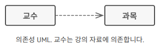
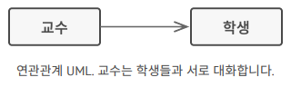
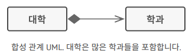
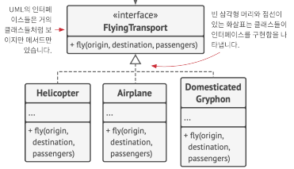
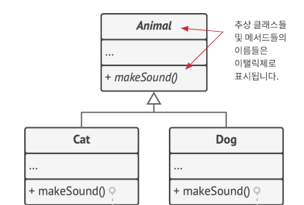
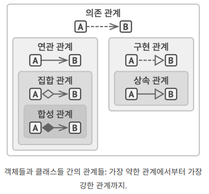

# 정보처리기사 실기
-----
-----
## UML
<br></br>
출제
- 24년 3회 13번
-----
### 1. 의존 관계

   - 한 클래스의 정의를 일부 변경했을 때, 다른 클래스가 영향을 받는 경우 두 클래스 사이에 의존성이 있다.
     ```java
     Class Professor {
          void teach(Course c) {
               // 만약 Course 클래스의 getKnowledge 메서드의 이름이나 매개변수를 변경한다면 더이상 이 코드는 동작x
               c.getKnowledge();
          }
     }
     ```
   - 일반적으로 *구상 클래스를 사용할 때 만들어진다.(Cat cat = new Cat())
     ```
     구상 클래스 vs 추상 클래스
     1) 구상(Concrete) 클래스 : Java나 C#에서 new를 사용해서 생성한 객체와 같이 모든 메서드를 구현한 클래스.
     2) 추상(Abstract) 클래스 : 인터페이스나 추상 클래스 등 바로 객체를 생성하지 못하고, 상속이나 구현체를 만들어 사용하도록 한 클래스.
     - 구상 클래스가 아닌 추상 클래스를 사용한다면 의존성을 약화시킬 수 있다. 
     ```
   - 보통 UML 다이어그램은 모든 의존 관계를 표시하지 않는다. 매우 많은 의존 관계가 있기 때문에 중요한 관계들만 선별적으로 표시한다.

### 2. 연관 관계
  
- 한 객체가 다른 객체를 사용하거나 두 객체가 상호작용하는 관계, 예를 들어 필드로 다른 객체를 포함할 때 연관관계가 된다.
- 연관 관계는 의존 관계일 뿐 아니라 해당 객체에 접근 할 수 있는 더 깊은 관계이다.
     ```java
     Class Professor {
          Student student;
          // ...
          void teach(Course c) {
               // student는 의존 관계이면서 Professor 클래스가 Student에 접근 할 수 있기 때문에 연관 관계이다.   
               student.remember(c.getKnowledge());
          }
     }
     ```

### 3. 집합 관계

- 집합 관계는 여러 객체 간의 1대N, N대N의 연관 관계이다.
- 컴포넌트(교수)는 화살표로 컨테이너(학과)는 빈 다이아몬드로 연결한다.
- 컨테이너가 사라져도 컴포넌트는 살아있는 관계이다.
     ```java
     class ComputerEngineeringMajor {
          private Professor aiProf;
          private Professor softwereEngProf;
          private Professor embeddedProf;
          
          // 컴퓨터 공학과 클래스가 사라져도 교수님 객체들은 사라지지 않는다.
          public ComputerEngineeringMajor(Professor ai, Professor softwere, Professor embedded){
               this.aiProf = ai;
               this.softwereEngProf = softwere;
               this.embeddedProf = embedded;
          }
     }
     ```

### 4. 합성 관계(포함 관계)

- 합성 관계는 특정 유형의 집합관계이다.
- 컨테이너는 각 컨테이너의 인스턴스와 제어권을 갖는다.

     ```java
     class ComputerEngineeringMajor {
          private AiProfessor aiProf;
          private SoftEngProfessor softEngProf;
          private EmbeddedProfessor embeddedProf;
          
          // 컴퓨터 공학과 클래스가 사라지면 생성된 교수님 객체들도 사라진다.
          public ComputerEngineeringMajor(){
               this.aiProf = new AiProfessor();
               this.softEngProf = new SoftEngProfessor();
               this.embeddedProf = new EmbeddedProfessor();
          }
     }
     ```
### 5. 구현 관계(실체화 관계)

- *인터페이스의 미구현 메서드를 구현한 관계이다.
- 인터페이스는 빈 삼각형 화살표, 구현체는 점선으로 이어진다.
     ```
     *인터페이스
     인터페이스는 다른 객체와 상호작용 할 수 있도록 공개된 부분이다.
     캡슐화를 위해 인터페이스를 사용하며, 캡슐화는 객체가 그 필드와 메서드의 일부만을 공개하고 싶을 때 유용하다.
     ```

### 6. 상속 관계(일반화 관계)

- 기존 클래스의 코드를 활용해서 새로운 클래스를 만들 때 사용된다.
- 대부분의 프로그래밍 언어에서 서브 클래스는 하나의 슈퍼 클래스만 갖을 수 있다.
- 슈퍼 클래스는 빈 삼각형 화살표, 서브 클래스는 실선으로 이어진다.

### 7. 큰 그림

- 의존 관계 : A는 B가 변경될 때 영향을 받을 수 있다.
- 연관 관계 : A가 B에 대해 알며, A는 B에 의존한다.
- 집합 관계 : A가 B에 대해 알며, A는 B에 의존, A에 B가 포함되어 있다.
- 합성 관계 : A가 B에 대해 알며, A는 B에 의존, A에 B가 포함, A에 따라 B의 수명 주기가 관리된다.
- 구현 관계 : A가 인터페이스 B를 구현한다. A는 B처럼 처리될 수 있으며, A는 B에 의존한다.
- 상속 관계 : A가 B의 인터페이스, 구현 관계를 상속하지만 이를 확장 할 수 있다. A는 B처럼 처리될 수 있으며, A는 B에 의존한다.

-----
-----
## SQL
<br></br>
출제
- 24년 3회 3번
-----
### 주요 용어
- Entity : 개체라고 해석되며, 일상 속 구분 가능하고 저장 가치가 있는 대상(학생, 주식, 고양이 등). 여러 속성(Attribute)의 집합.
- Schema : 구조라는 뜻이며, DB 내에 데이터가 어떻게 저장되는지 구조, 제약조건, 개체, 관계를 기술한 것. DB Schema와 Table Schema가 있다.
     - DB Schema는 전체적인 데이터 베이스의 구조와 제약조건을 정의.
     - Table Schema는 특정 테이블의 구조와 제약조건을 정의.
- Table : 행과 열로 구성된 데이터 구조.
- Object : 데이터 베이스에서 객체는 데이터를 저장하고 관리하는데 사용되는 기본 단위이다.
     - 데이터베이스의 Object : Table, View, Index, Sequence, Procedure, Method, Package
- Domain : 
- Relation : 개체와 개체 간의 관계
- Attribute(Column) : 개체의 고유한 특성. 저장 데이터의 가장 작은 단위.
- Instance(Row) : 개체의 실제 데이터 객체, 행
- Procedure : DB 내에서 특정 작업을 수행하는 코드 블록. 일련의 쿼리를 하나의 함수처럼 실행하기 위한 쿼리의 집합이지만, 함수와 달리 반환 값이 없고 출력 매개변수를 통해 결과를 반환한다.

### SQL(Structured Query Language)의 주요 요소
1. 데이터 정의 언어(DDL; Data Definition Language)  
     : 데이터베이스, 테이블, 컬럼 등의 '구조'를 정의
     - CREATE, ALTER, DROP
2. 데이터 조작 언어(DML; Data Manipulate Language)  
     : 데이터를 검색하거나 조작하기 위해 사용
     - SELECT, UPDATE, DELETE
3. 데이터 제어 언어(DCL; Data Control Language)  
     : 데이터 접근 권한을 관리
     - GRANT, REVOKE

#### 1. DDL
##### DDL의 정의
- 오브젝트를 정의하는 언어
     ```
     오브젝트의 종류
     1. Schema : 데이터 구조 
     2. Domain : Attribute가 가질 수 있는 값의 범위, 데이터 타입, 제약사항를 정의한 것.
     ```
##### 데이터베이스 생성
```sql
CREATE DATABASE my_db
```

##### 테이블 생성
```sql
CREATE TABLE students(
     id INT,
     name VARCHAR(50),
     age INT
)
```
##### 테이블 변경(열 추가)
```sql
ALTER TABLE students ADD COLUMN score VARCHAR(10)
```
##### 테이블 삭제
```sql
DROP TABLE students
```
<br></br>
#### 2. DML 명령어
##### 데이터 삽입
```sql
INSERT INTO students (id, name, age, score) VALUES (1, 'John', 30, 'B')
```
##### 데이터 조회
```sql
SELECT * FROM students
```
##### 데이터 업데이트
```sql
UPDATE students SET age = 40 WHERE id = 1
```
##### 데이터 삭제
```sql
DELETE FROM students WHERE id = 1
```
<br></br>
#### 3. DCL 명령어
##### 사용자에게 권한 부여
```sql
GRANT SELECT, INSERT ON students TO user1
```
##### 사용자의 권한 취소
```sql
REVOKE UPDATE ON students FROM user2
```
##### Role 생성
```sql
CREATE ROLE professor
```
- `professor` 이라는 이름의 롤을 생성. 롤은 여러 사용자에게 동일한 권한을 일괄적으로 부여하기 위해 사용
##### Role에 권한 부여
```sql
GRANT SELECT, UPDATE ON students TO professor
```
- `professor` Role에게 `students` 테이블에 대한 SELECT, UPDATE 권한을 부여하는 구문.
- `professor` Role의 모든 사용자는 해당 테이블에 대한 부여된 권한을 받는다.
<br></br>

### 데이터 타입
- Oracle

CHAR(n)
VARCHAR2(n)
NCHAR(n)
NVARCHAR2(n)
LONG
CLOB
NCLOB


<br></br>

### 테이블 생성
```sql
CREATE TABLE stocks (
     code INT PRIMARY KEY,
     open_price 
)
```
<br></br>  

-----
## 정규화
<br></br>
출제
- ㅇ
-----
### 제1 정규화
- 도메인이 원자값 : 모든 속성 값이 원자값을 갖는다, 하나의 속성에는 하나의 값만 갖는다.
```

```

### 제2 정규화
- 부분적 함수 종속 제거

### 제3 정규화
- 이행적 함수 종속 제거

### BCNF 정규화
- 결정자이면서 후보키가 아닌 것 제거

### 제4 정규화
- 다치 종속 제거

### 제5 정규화
- 조인 종속성 이용


